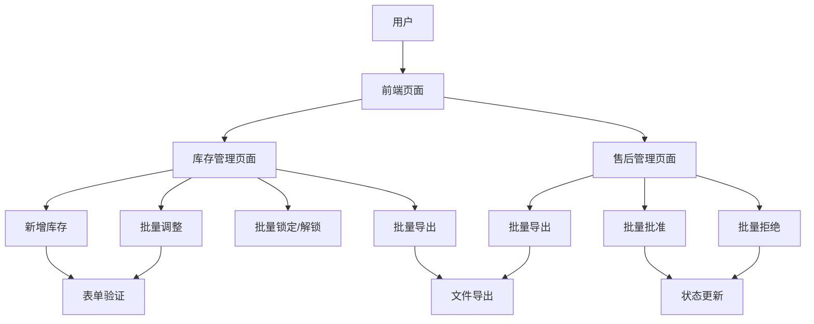
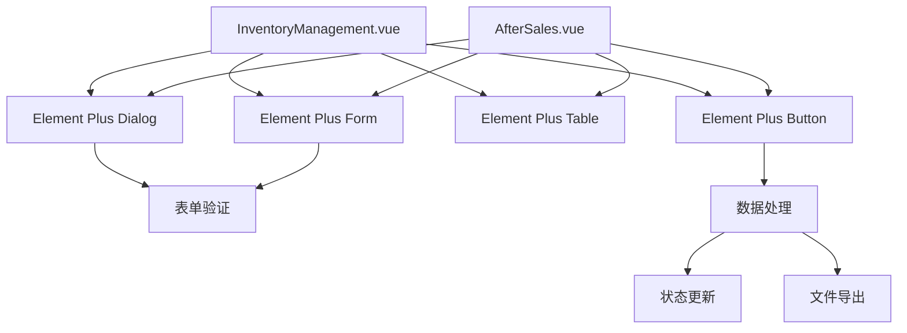
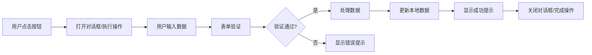
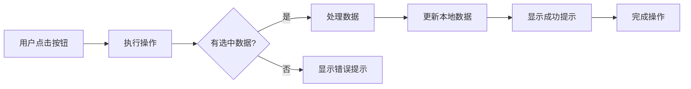

# 按钮功能完善设计文档

## 1. 整体架构图

## 2. 系统分层设计与核心组件定义

### 2.1 前端页面层
- **库存管理页面**：负责展示和管理库存数据，包括新增、调整、锁定/解锁、导出等功能
- **售后管理页面**：负责展示和管理售后申请，包括批准、拒绝、导出等功能

### 2.2 组件层
- **对话框组件**：用于新增库存、批量调整等操作的表单输入
- **表格组件**：用于展示库存和售后申请数据
- **按钮组件**：用于触发各种操作

### 2.3 逻辑层
- **数据处理逻辑**：处理库存和售后申请的数据更新
- **表单验证逻辑**：验证用户输入的有效性
- **导出逻辑**：处理数据导出功能

## 3. 模块依赖关系图

## 4. 接口契约完整定义

### 4.1 库存管理页面

#### 4.1.1 新增库存
- **输入**：
  - sku: string (商品编码)
  - name: string (商品名称)
  - warehouseId: string (仓库ID)
  - quantity: number (总库存)
  - reserved: number (已预留库存)
  - description: string (商品描述)
- **输出**：
  - 成功：更新库存列表，显示成功提示
  - 失败：显示错误提示

#### 4.1.2 批量调整
- **输入**：
  - adjustType: string (调整类型：增加/减少/设置)
  - adjustValue: number (调整数量)
  - reason: string (调整原因)
- **输出**：
  - 成功：更新选中库存的数量，显示成功提示
  - 失败：显示错误提示

#### 4.1.3 批量锁定/解锁
- **输入**：
  - 选中的库存列表
- **输出**：
  - 成功：更新选中库存的状态，显示成功提示
  - 失败：显示错误提示

#### 4.1.4 批量导出
- **输入**：
  - 选中的库存列表
- **输出**：
  - 成功：下载JSON文件
  - 失败：显示错误提示

### 4.2 售后管理页面

#### 4.2.1 批量批准/拒绝
- **输入**：
  - 选中的售后申请列表
- **输出**：
  - 成功：更新选中售后申请的状态，显示成功提示
  - 失败：显示错误提示

#### 4.2.2 批量导出
- **输入**：
  - 选中的售后申请列表
- **输出**：
  - 成功：下载JSON文件
  - 失败：显示错误提示

## 5. 核心业务数据流向图

### 5.1 库存管理页面

### 5.2 售后管理页面

## 6. 全局异常处理策略

- **表单验证异常**：显示表单验证错误提示
- **操作异常**：显示操作失败提示
- **数据异常**：显示数据处理错误提示
- **网络异常**：显示网络连接错误提示

## 7. 安全设计与合规适配方案

- **输入验证**：对用户输入进行严格验证，防止恶意输入
- **数据安全**：确保数据处理过程中的安全性
- **权限控制**：确保用户只能执行有权限的操作
- **合规性**：确保功能实现符合相关法规和规范