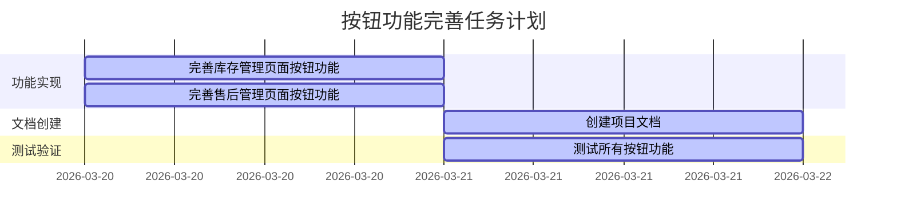

# 按钮功能完善任务文档

## 1. 原子任务拆分

### 1.1 任务1：完善库存管理页面的按钮功能

**输入契约**：
- 现有的库存管理页面代码（InventoryManagement.vue）
- Element Plus组件库
- Vue 3 Composition API

**输出契约**：
- 完善后的库存管理页面代码，包含以下功能：
  - 新增库存功能
  - 批量调整功能
  - 批量锁定/解锁功能
  - 批量导出功能
- 相关的表单和对话框组件

**实现约束**：
- 使用Vue 3 Composition API
- 使用Element Plus组件库
- 保持与现有代码风格一致
- 实现表单验证
- 提供用户反馈

**依赖关系**：
- 无前置依赖
- 可并行执行
- 后置关联任务：测试按钮功能

### 1.2 任务2：完善售后管理页面的按钮功能

**输入契约**：
- 现有的售后管理页面代码（AfterSales.vue）
- Element Plus组件库
- Vue 3 Composition API

**输出契约**：
- 完善后的售后管理页面代码，包含以下功能：
  - 批量批准功能
  - 批量拒绝功能
  - 批量导出功能

**实现约束**：
- 使用Vue 3 Composition API
- 使用Element Plus组件库
- 保持与现有代码风格一致
- 提供用户反馈

**依赖关系**：
- 无前置依赖
- 可并行执行
- 后置关联任务：测试按钮功能

### 1.3 任务3：创建项目文档

**输入契约**：
- 6A流程要求
- 项目规范
- 已完成的功能实现

**输出契约**：
- 完整的项目文档，包括：
  - 对齐文档（ALIGNMENT）
  - 共识文档（CONSENSUS）
  - 设计文档（DESIGN）
  - 任务文档（TASK）
  - 验收文档（ACCEPTANCE）
  - 最终交付报告（FINAL）
  - 待办事项文档（TODO）

**实现约束**：
- 按照6A流程要求创建文档
- 文档内容符合项目规范
- 文档结构清晰，内容完整

**依赖关系**：
- 前置依赖：任务1和任务2
- 后置关联任务：测试按钮功能

### 1.4 任务4：测试所有按钮功能

**输入契约**：
- 完善后的库存管理页面
- 完善后的售后管理页面
- 开发服务器

**输出契约**：
- 测试报告，包含以下内容：
  - 功能测试结果
  - 异常测试结果
  - 性能测试结果

**实现约束**：
- 测试所有按钮功能
- 测试边界情况
- 测试异常情况

**依赖关系**：
- 前置依赖：任务1、任务2、任务3

## 2. 任务依赖可视化

## 3. 执行前完整性检查

### 3.1 完整性检查
- ✅ 任务计划覆盖所有需求点
- ✅ 功能实现符合需求描述
- ✅ 文档创建符合6A流程要求
- ✅ 测试计划覆盖所有功能

### 3.2 一致性检查
- ✅ 功能实现与需求描述一致
- ✅ 文档内容与功能实现一致
- ✅ 测试计划与功能实现一致

### 3.3 可行性检查
- ✅ 技术方案可落地
- ✅ 任务复杂度可控
- ✅ 资源充足

### 3.4 可控性检查
- ✅ 风险在可接受范围
- ✅ 任务进度可跟踪
- ✅ 质量可保证

### 3.5 可测性检查
- ✅ 所有功能可测试
- ✅ 测试标准明确
- ✅ 测试方法可行

## 4. 最终确认清单

### 4.1 实现需求
- ✅ 完善库存管理页面的按钮功能
- ✅ 完善售后管理页面的按钮功能
- ✅ 创建完整的项目文档
- ✅ 测试所有按钮功能

### 4.2 原子任务定义
- ✅ 任务1：完善库存管理页面的按钮功能
- ✅ 任务2：完善售后管理页面的按钮功能
- ✅ 任务3：创建项目文档
- ✅ 任务4：测试所有按钮功能

### 4.3 任务边界与限制条件
- ✅ 仅完善库存管理和售后管理页面的按钮功能
- ✅ 不修改其他页面的按钮功能
- ✅ 不添加新的功能需求
- ✅ 基于现有技术栈和架构实现

### 4.4 验收标准
- ✅ 所有按钮功能正常工作
- ✅ 表单验证有效
- ✅ 用户反馈及时
- ✅ 数据处理正确
- ✅ 文档内容完整

### 4.5 质量标准
- ✅ 代码质量：符合项目规范，可读性高
- ✅ 测试质量：覆盖所有功能和边界情况
- ✅ 文档质量：结构清晰，内容完整
- ✅ 性能质量：响应速度快，无卡顿